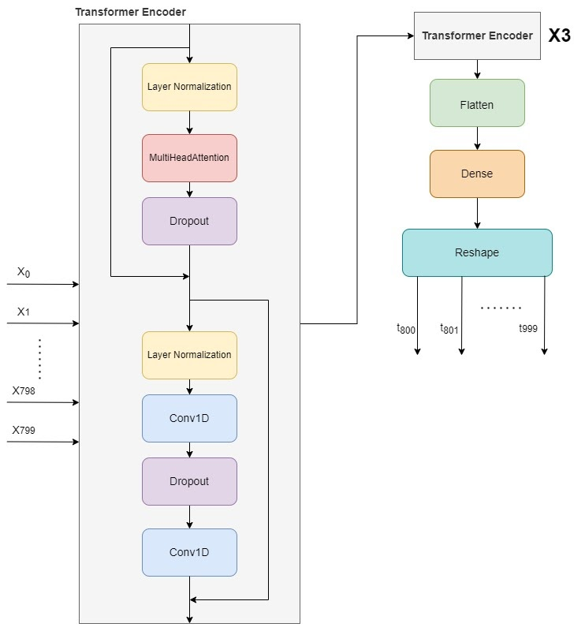

# Multivariate time seeries forecasting with DNN

This is a project done in the context of _Artificial Neural Network for Deep Learning_ course at Politecnico di Milano.

### Requirement

I am required to predict future samples of a multivariate time series. The goal is to design and implement forecasting models to learn how to exploit past observations in the input sequence to correctly predict the future.

### Dataset

- Length of the time series (number of samples in the training set): 68528
- Number of features: 7
- Name of the features: 'Sponginess', 'Wonder level', 'Crunchiness', 'Loudness on impact', 'Meme creativity', 'Soap slipperiness', 'Hype root'

The provided time series has a uniform sampling rate.   

## Models Implemented

---

### Seq2Seq

The first model I tried was an encoder decoder architecture similar to _Seq2Seq_, with the implementation of _Luong_ attention.
 
The encoder part was a _LSTM_ (Long Short Term Memory) layer that takes in input a sequence of length equal to the window and outputs all the hidden states of the LSTM cells.
 
The decoder was also made of a LSTM layer that has the number of cells equal to the value of the telescope. The hidden state and cell state of the last cell of the encoder are used as initial states for the decoder. The last hidden state of the encoder is also copied by a RepeatVector layer and fed as input into each cell of the decoder.
 
I implemented attention by performing a dot product between all the encoder hidden states and all the decoder hidden states. From that I obtained the attention vector for each decoder cell. Performing a dot product between the attention vector and the encoder hidden states gives the context vector for each decoder cell, that is then concatenated to the hidden state of the corresponding decoder cell.
 
The sequence of concatenated hidden states and vectors is fed into a TimeDistributed layer that computes the output with a fully connected layer inside. We used BatchNormalization in between the layers to reduce gradient explosions.

### Transformer

The last architecture that I tried was the transformer architecture.
This adopts the mechanism of self-attention, differentially weighting the significance of each part of the input data.
My implementation consists of stacked encoders that feed directly into a flatten layer, followed by a dense layer to predict the output.
  Here a diagram of the model:  

